# 💊 Pill Manager

<div align="center">

[](https://python.org/)
[](https://www.sqlite.org/)
[](https://calendar.google.com/)
[](https://github.com/Textualize/rich)

*Automated ADHD medication distribution tracker for split custody schedules* 🏴‍☠️

</div>

## Overview 🎯

**Pill Manager** is a Python CLI tool designed to manage ADHD medication distribution between co-parents in split custody arrangements. It automatically calculates refill eligibility based on insurance rules (85% threshold), tracks pill distribution, and creates Google Calendar reminders for critical dates.

**Why This Exists:**
- Managing Schedule II controlled substances with split custody is complex
- Insurance companies enforce strict refill timing (85% rule for controlled substances)
- Missing a refill window can cause medication gaps
- Manual tracking is error-prone and time-consuming

**This tool solves all of that.** ⚓

---

## Features ✨

- **📅 Smart Refill Calculations**: Automatically calculates refill eligibility using the 85% rule (Day 26 for 30-day supply)
- **👥 Custody-Aware Distribution**: Integrates with Google Calendar to parse custody schedules and calculate pill days
- **💊 Accurate Tracking**: Tracks multiple distributions per fill with clean accounting
- **🔔 Calendar Automation**: Auto-creates Google Calendar events for refills, run-out dates, and distribution reminders
- **🎯 Golden Rule Logic**: "Whoever the child wakes up with gives the pill" - handles 5pm handoffs correctly
- **🔍 Searchable Events**: All events tagged with `[ADHD-PILLS]` for easy filtering
- **📊 Rich CLI Interface**: Beautiful terminal UI with color-coded status and warnings

---

## Architecture 🏗️

```mermaid
graph TD
    A[👤 User CLI] --> B[💾 SQLite Database]
    A --> C[🗓️ Google Calendar API]
    
    B --> D[📋 Fills Tracker]
    B --> E[📦 Distributions Tracker]
    
    C --> F[📅 Custody Reader]
    F --> G[🧮 Calculator]
    
    G --> H[📊 Status Dashboard]
    G --> I[🔔 Event Creator]
    
    I --> C
    
    style A fill:#4285F4,stroke:#fff,stroke-width:2px,color:#fff
    style B fill:#003B57,stroke:#fff,stroke-width:2px,color:#fff
    style C fill:#0F9D58,stroke:#fff,stroke-width:2px,color:#fff
    style G fill:#F4B400,stroke:#fff,stroke-width:2px
    style H fill:#DB4437,stroke:#fff,stroke-width:2px,color:#fff
```



### Components

| Component | Description |
|-----------|-------------|
| 🗄️ **Database** | SQLite storage for prescription fills, distributions, and settings |
| 🧮 **Calculator** | Implements 85% refill rule and distribution logic |
| 📅 **Custody Reader** | Parses Google Calendar events to determine custody days |
| 🔔 **Event Creator** | Generates Google Calendar reminders with custom colors and alerts |
| 💻 **CLI** | Rich-powered terminal interface with status dashboard |

---

## Quick Start 🚀

### Prerequisites

- Python 3.8+
- [g-cal-tools](https://github.com/bspeagle/g-cal-tools) - Google Calendar integration library
- Google Calendar API credentials ([Setup Guide](https://developers.google.com/calendar/api/quickstart/python))
- Virtual environment (recommended)

### Installation

```bash
# Clone g-cal-tools (required dependency)
cd ~/Projects  # or your preferred directory
git clone https://github.com/bspeagle/g-cal-tools.git

# Clone pill_manager as a sibling directory
git clone https://github.com/bspeagle/pill_manager.git
cd pill_manager

# Create virtual environment
python3 -m venv venv
source venv/bin/activate  # On Windows: venv\Scripts\activate

# Install dependencies
pip install -r requirements.txt

# Configure environment
cp .env.example .env
# Edit .env with your calendar IDs (see Configuration section)
```

### Configuration

1. **Find your Google Calendar ID:**
   ```bash
   python scripts/list_calendars.py
   ```

2. **Update `.env` file:**
   ```bash
   GOOGLE_CALENDAR_CUSTODY_ID=your_calendar_id@group.calendar.google.com
   ```

3. **Seed initial data:**
   ```bash
   # Edit scripts/seed_database.py with your current prescription info
   python scripts/seed_database.py
   ```

---

## Usage 📖

### Show Current Status

```bash
python src/cli/main.py status
```

**Example Output:**
```
💊 Pill Manager Status

📋 Last Prescription Fill
  Date: October 08, 2025 (20 days ago)
  Quantity: 30 pills
  Pharmacy: Publix #1250

🔄 Next Refill Eligible
  Date: November 02, 2025
  Status: ⏳ 5 days until eligible

👤 Co-Parent Status
  Last Distribution: October 31, 2025 (3 pills)
  Total Distributed: 19 pills
  Runs Out: November 03, 2025
  Pills Remaining: 11
```

### Record Distribution

```bash
python src/cli/main.py record-distribution \
  --date 2025-10-31 \
  --quantity 3 \
  --notes "Extra pills for weekend"
```

### Sync Calendar Events

```bash
python src/cli/main.py sync-calendar
```

Creates 3 calendar events:
- 💊 **[ADHD-PILLS] Ex Out of Meds** (Red, 1-day reminder)
- 💊 **[ADHD-PILLS] Can Refill Prescription** (Blue, day-of reminder)
- 💊 **[ADHD-PILLS] Give X Pills to Ex** (Green, 1-hour + 1-day reminders)

---

## How It Works 🔧

### The 85% Rule

Georgia law prohibits Schedule II refills, but insurance allows new prescriptions after **85% of days** have elapsed:

```
30-day supply → Eligible on Day 26 (85% of 30)
60-day supply → Eligible on Day 51 (85% of 60)
90-day supply → Eligible on Day 77 (85% of 90)
```

### Custody Schedule Integration

The system reads your Google Calendar and identifies custody blocks:
- Events with "**Brian**" (or configured name) in title = father's custody
- All other days = mother's custody
- **Golden Rule**: Parent with morning custody gives the pill (handles 5pm handoffs)

### Distribution Calculation

1. Parse custody schedule for next 30 days
2. Count mother's pill days
3. Distribution date = **day before** her next pill day (custody pickup)
4. Accounts for all distributions from current fill

---

## Project Structure 📁

```
pill_manager/
├── src/
│   ├── core/
│   │   ├── database.py          # SQLite operations
│   │   └── calculator.py        # Refill & distribution logic
│   ├── integrations/
│   │   ├── custody_reader.py    # Google Calendar parser
│   │   └── calendar_events.py   # Event creator
│   └── cli/
│       └── main.py              # CLI interface
├── scripts/
│   ├── list_calendars.py        # Find calendar IDs
│   └── seed_database.py         # Initial data setup
├── data/                         # SQLite database (gitignored)
├── .env.example                  # Configuration template
└── requirements.txt              # Python dependencies
```

---

## Configuration Reference ⚙️

### Environment Variables

| Variable | Description | Example |
|----------|-------------|---------|
| `GOOGLE_CALENDAR_CUSTODY_ID` | Calendar ID for custody schedule | `abc123@group.calendar.google.com` |
| `DEFAULT_PILL_QUANTITY` | Default pills per prescription | `30` |
| `REFILL_THRESHOLD_PERCENTAGE` | Insurance refill threshold | `85` |
| `DATABASE_PATH` | Path to SQLite database | `data/pill_manager.db` |

### Database Schema

**Tables:**
- `prescription_fills`: Fill date, quantity, pharmacy, Rx number
- `distributions`: Date given, quantity, associated fill
- `settings`: App configuration key-value pairs
- `calendar_events`: Synced event tracking

---

## Troubleshooting 🔍

### "No distribution data found"
Run `seed_database.py` to initialize with your current prescription data.

### "Calendar ID not configured"
Run `list_calendars.py` to find your calendar ID and update `.env`.

### Math doesn't add up
The system sums **all distributions** for a fill. Example:
- Fill: 30 pills
- Dist 1: 16 pills
- Dist 2: 3 pills
- **Remaining: 11 pills** ✅

---

## Development 🛠️

### Running Tests
```bash
pytest tests/
```

### Code Style
Following [Windsurf Development Rules](/.windsurfrules):
- Max 300 lines per file (excluding Terraform)
- Comprehensive documentation
- Type hints where appropriate

---

## Contributing 🤝

Contributions welcome! Please:

1. Fork the repository
2. Create a feature branch (`git checkout -b feature/amazing-feature`)
3. Commit your changes (`git commit -m 'feat: Add amazing feature'`)
4. Push to the branch (`git push origin feature/amazing-feature`)
5. Open a Pull Request

---

## License 📄

This project is licensed under the MIT License - see the [LICENSE](LICENSE) file for details.

---

## Acknowledgments 🙏

- Built with [Rich](https://github.com/Textualize/rich) for beautiful terminal UI
- Integrates with [g-cal-tools](https://github.com/bspeagle/g-cal-tools) for Google Calendar operations
- Inspired by the complexity of managing controlled substances in split custody arrangements

---

## Roadmap 🗺️

- [ ] `record-fill` command for new prescriptions
- [ ] `history` command for viewing past fills/distributions
- [ ] Web UI for easier access
- [ ] SMS/Email notifications
- [ ] Multi-child support
- [ ] Pharmacy API integration
- [ ] Export reports for legal documentation

---

<div align="center">

**Built with 🏴‍☠️ by developers who understand split custody struggles**

*"A well-tracked treasure is never lost!"* ⚓

</div>
