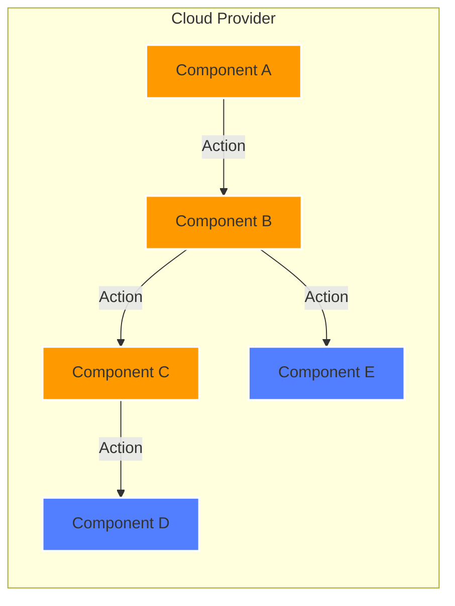

# 🚀 [Project Name]

<div align="center">

[](https://technology1.com/)
[](https://technology2.com/)
[](https://technology3.com/)
[](https://github.com/psf/black)

*[One-line project description]* 🛠️

</div>

## Overview 🎯

[Brief, compelling description of your project. What does it do? Why is it useful?]

## Features ✨

- **Feature 1**: [Brief description]
- **Feature 2**: [Brief description]
- **Feature 3**: [Brief description]
- **Feature 4**: [Brief description]

## Architecture 🏗️



### Components

| Component | Description |
|-----------|-------------|
| 🔄 Component A | [Brief description] |
| 🌐 Component B | [Brief description] |
| 📊 Component C | [Brief description] |
| 💾 Component D | [Brief description] |
| 🔐 Component E | [Brief description] |

## Prerequisites 📋

- Requirement 1 >= version
- Requirement 2 >= version
- Requirement 3 >= version
- Requirement 4 >= version

## Quick Start 🚦

1. Clone the repository
2. Install dependencies:
   ```bash
   cd [project-directory]
   npm install
   ```
3. Deploy infrastructure:
   ```bash
   cd [deployment-directory]
   npm run deploy
   ```

## Project Structure 🗂️

```
.
├── src/              # Source code
│   ├── [file1]       # [Description]
│   └── [file2]       # [Description]
├── tests/            # Test files
│   └── [test-suite]/ # [Description]
│       ├── [test1]/  # [Description]
│       ├── [test2]/  # [Description]
│       └── [test3]/  # [Description]
└── config/           # Configuration files
    └── [region]/     # [Description]
        └── [env]/    # [Description]
            └── [stack]/ # [Description]
```

## Configuration ⚙️

```bash
VARIABLE_1=value    # Description
VARIABLE_2=value    # Description
VARIABLE_3=value    # Description
```

## Development 💻

- Code formatting standards
- Linting requirements
- Pre-commit hooks
- Development workflow

## Monitoring & Logging 📊

- [Monitoring tool] provides detailed status information
- Events and changes are clearly logged
- Metrics and state changes are tracked
- Automated alerts and notifications

## Security 🔒

- IAM roles and permissions
- Network security
- Encryption standards
- Security best practices

## Infrastructure Modules 🏗️

Each module has its own detailed README with configuration options:
- **Module 1**: [Brief description]
- **Module 2**: [Brief description]
- **Module 3**: [Brief description]
- **Module 4**: [Brief description]

## Troubleshooting 🔍

### Common Issues
1. **Issue 1**
   - [Possible causes]
   - [Solution steps]

2. **Issue 2**
   - [Possible causes]
   - [Solution steps]

### Debug Mode
[Instructions for enabling debug mode and additional logging]

---

<div align="center">

**[ [Back to Top](#-project-name) ]**

</div>
